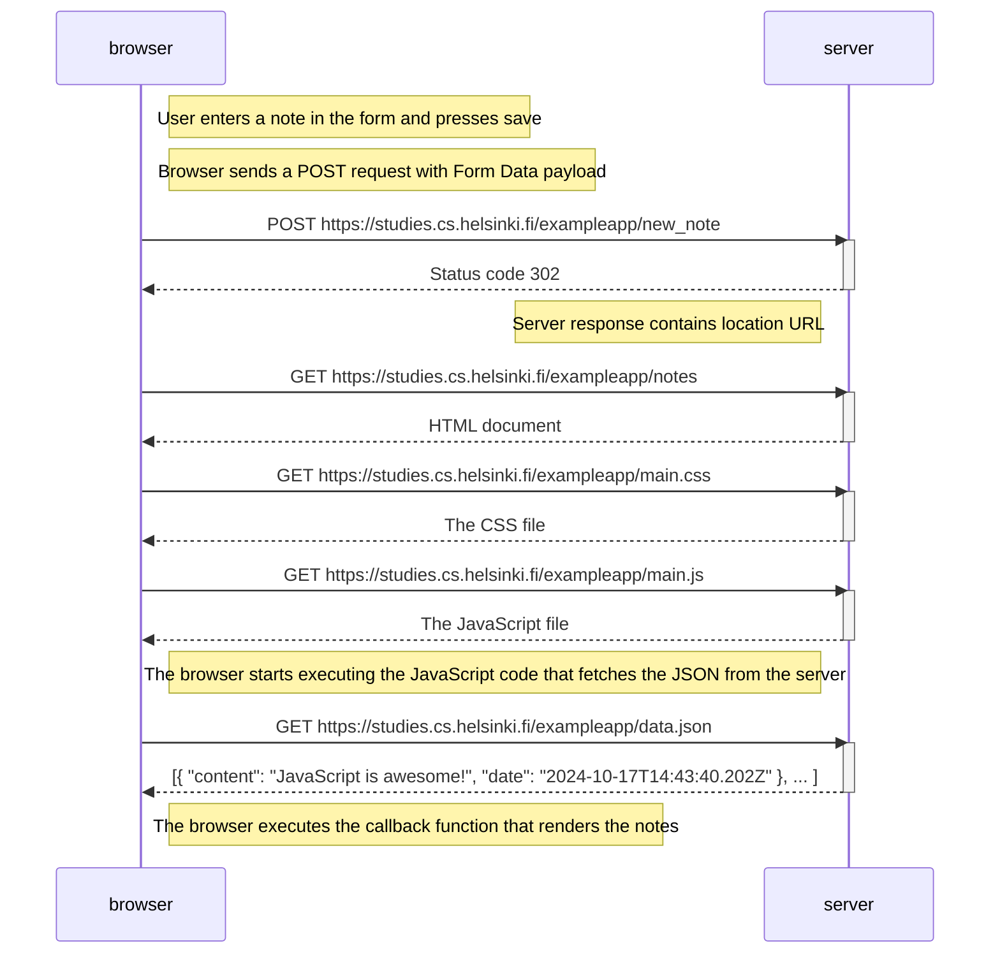

```mermaid
sequenceDiagram
participant browser
    participant server

    Note right of browser: User enters a note in the form and presses save

    Note right of browser: Browser sends a POST request with Form Data payload

    browser->>server: POST https://studies.cs.helsinki.fi/exampleapp/new_note

    activate server
    server-->>browser: Status code 302
    deactivate server

    Note left of server: Server response contains location URL

    browser->>server: GET https://studies.cs.helsinki.fi/exampleapp/notes
    activate server
    server-->>browser: HTML document
    deactivate server

    browser->>server: GET https://studies.cs.helsinki.fi/exampleapp/main.css
    activate server
    server-->>browser: The CSS file
    deactivate server

    browser->>server: GET https://studies.cs.helsinki.fi/exampleapp/main.js
    activate server
    server-->>browser: The JavaScript file
    deactivate server

    Note right of browser: The browser starts executing the JavaScript code that fetches the JSON from the server

    browser->>server: GET https://studies.cs.helsinki.fi/exampleapp/data.json
    activate server
    server-->>browser: [{ "content": "JavaScript is awesome!", "date": "2024-10-17T14:43:40.202Z" }, ... ]
    deactivate server

    Note right of browser: The browser executes the callback function that renders the notes
```
