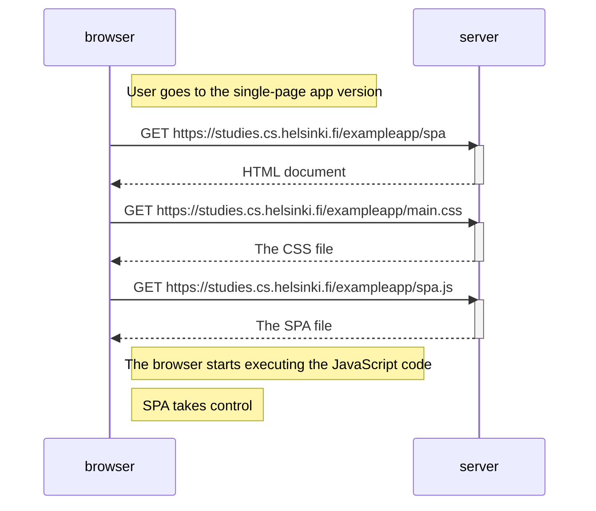

```mermaid
sequenceDiagram
    participant browser
    participant server

    Note right of browser: User goes to the single-page app version 
    browser->>server: GET https://studies.cs.helsinki.fi/exampleapp/spa
    activate server
    server-->>browser: HTML document
    deactivate server

    browser->>server: GET https://studies.cs.helsinki.fi/exampleapp/main.css
    activate server
    server-->>browser: The CSS file
    deactivate server

    browser->>server: GET https://studies.cs.helsinki.fi/exampleapp/spa.js
    activate server
    server-->>browser: The SPA file
    deactivate server

    Note right of browser: The browser starts executing the JavaScript code

    Note right of browser: SPA takes control
```