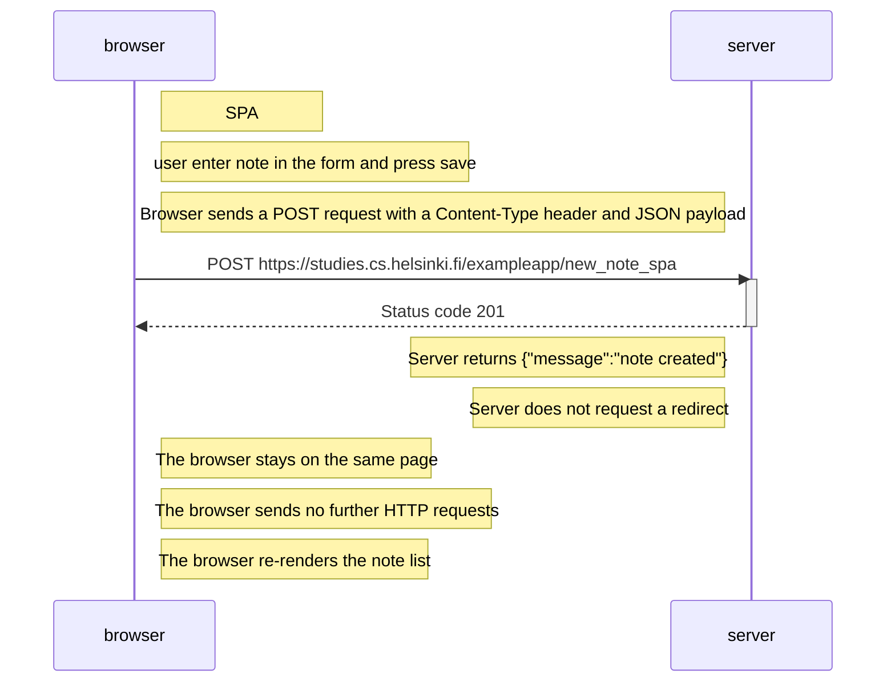

```mermaid
sequenceDiagram
    participant browser
    participant server

    Note right of browser: SPA
    Note right of browser: user enter note in the form and press save

    Note right of browser: Browser sends a POST request with a Content-Type header and JSON payload

    browser->>server: POST https://studies.cs.helsinki.fi/exampleapp/new_note_spa

    activate server
    server-->>browser: Status code 201
    deactivate server

    Note left of server: Server returns {"message":"note created"}

    Note left of server: Server does not request a redirect

    Note right of browser: The browser stays on the same page

    Note right of browser: The browser sends no further HTTP requests

    Note right of browser: The browser re-renders the note list

```